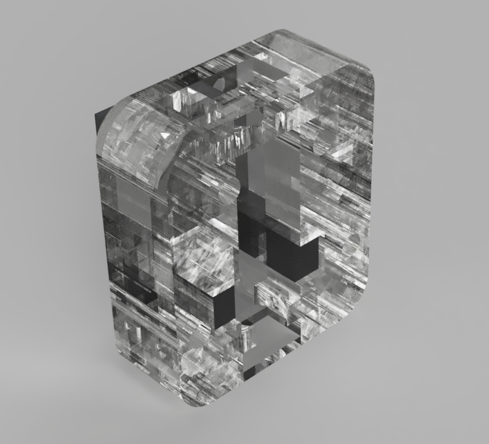

# WiggleGate - Build

Here are the steps to construct WiggleGate V0.0.1, a device designed to detect worm movement through the utilization of a straightforward infrared sensor.

## Bill of materials

### Materials
- Wood or acrylic
- [Light slot Sensor Module - 10mm](https://www.tinytronics.nl/shop/en/sensors/optical/light-slots/licht-slot-sensor-module-10mm)
- 4x M3 [Nuts and bolts](https://www.tinytronics.nl/shop/en/tools-and-mounting/installation-and-mounting-material/bolts/bolt-nut-and-washer-set-m2-m3-m4-including-3-allen-keys-1080-pieces)
- [Plastic tube](https://www.tinytronics.nl/shop/en/mechanics-and-actuators/parts/hoses/waterhose-for-under-water-pump-verticalhorizontal-3-6v-transparent-20cm)

### Tools
- Laser cutter

## Instructions

1. Lasercut the files in [/Design/LaserCut]([./Design/LaserCut])
2. Attach the Light slot Sensor Module
3. Insert bolts, but do not tighten yet
4. Insert plastic tube
5. Tighten bolts