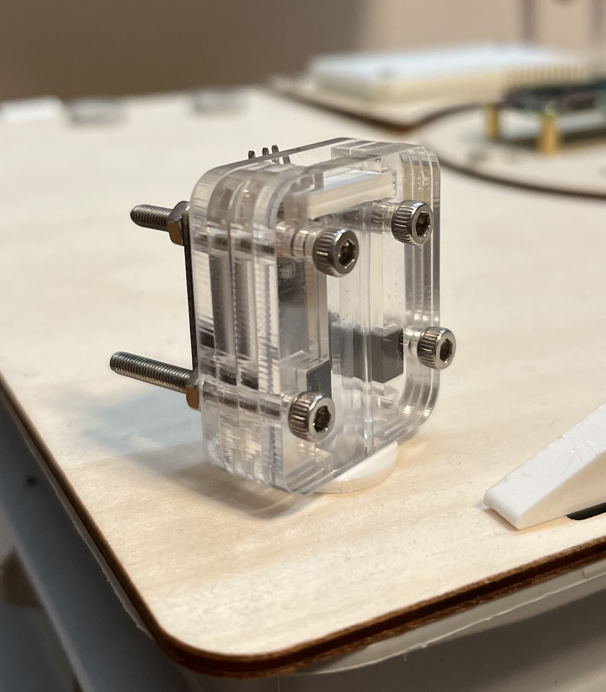

# WiggleGate

WiggleGate detects worm movement by using a simple infrared sensor. This approach allows for non-intrusive and highly sensitive detection, enabling researchers and enthusiasts to gain valuable insights into the behavior and activity patterns of these fascinating creatures. 

Whether employed in agricultural research to optimize soil health or in ecological studies to understand the underground dynamics of ecosystems, the use of an infrared sensor provides a reliable and efficient means to observe worm movement in various contexts.

Build your own WiggleGate using the [instructions](./BUILD.md) provided.

## License

The WiggleBin is open source hardware. Hardware is covered under CERN-OHL-S-2.0 (`LICENSE.CERN-OHL-S-2.0.txt`) license and software under GPL-3.0-or-later (`LICENSE.GPL-3.0-or-later.txt`) license.

## Thanks!

Many thanks to [Open Hardware Academy](https://www.openhardware.academy/01_Welcome.html)